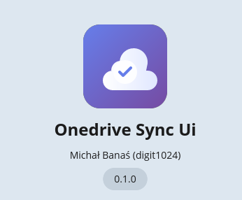
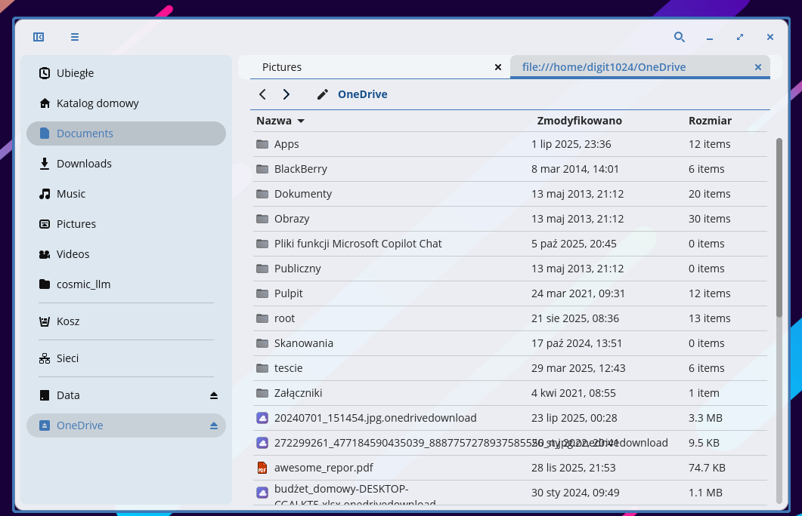
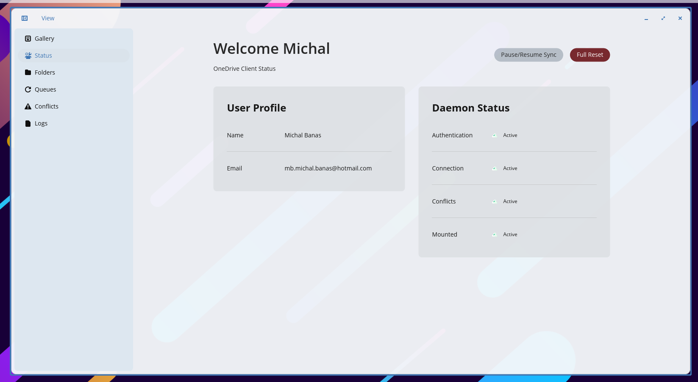
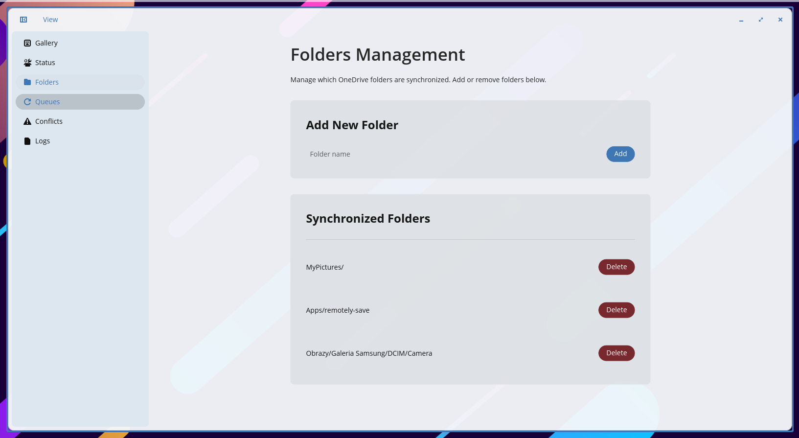
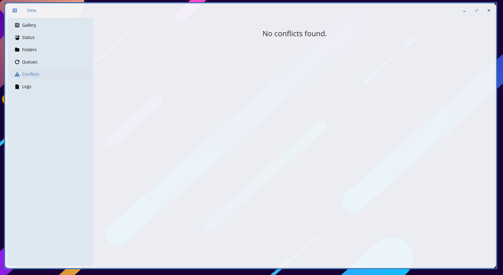
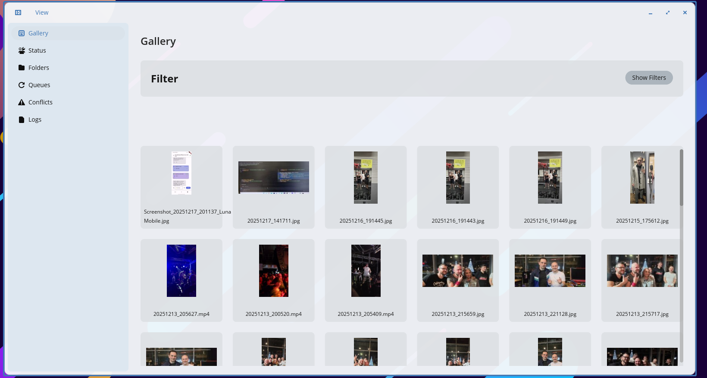
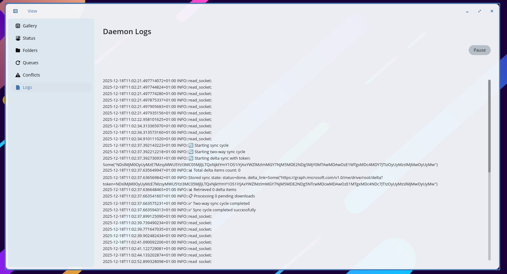

# Open OneDrive

A Linux client for Microsoft OneDrive that mounts your cloud storage as a local filesystem.

<div style="display: flex; justify-content: center; margin: 2rem 0;">
  
</div>


## The Filesystem

The core of this project is a **FUSE filesystem** that mounts your OneDrive directly to a local path (default: `~/OneDrive`). You can browse your files using any file manager, terminal, or application - just like local files.

**But there's a twist.**

Files aren't downloaded until you need them. When you browse your OneDrive, you see all your files and folders with their real names and sizes. However, files that haven't been downloaded yet appear with a `.onedrivedownload` extension.

```
~/OneDrive/
├── Documents/
│   ├── report.pdf.onedrivedownload    ← not downloaded yet
│   ├── notes.txt                       ← already local
│   └── photos/
│       └── vacation.jpg.onedrivedownload
└── Projects/
    └── code.zip
```

**To download a file**, just open it - double-click in your file manager or open with daemon in cli.  The daemon downloads the file from OneDrive, and serves the real content. Next time you access it, it's already there.
(this also blocks those ducking stupid thumbnail creation for thousands of your pictures in galery )

**You can also specify which folder files shoudl be downloaded automatically!!!!!**




## Components

The project consists of three parts:

### Daemon (`onedrive-sync-daemon`)

The background service that does the heavy lifting:
- Mounts the FUSE filesystem
- Syncs metadata from OneDrive (delta sync)
- Handles file downloads on demand
- Processes local changes and uploads them
- Exposes a D-Bus API for the UI and applet

### UI (`onedrive-sync-ui`)

A graphical interface built with [libcosmic](https://github.com/pop-os/libcosmic) for COSMIC/Pop!_OS desktops. Lets you:

- Monitor sync status and daemon health
- Configure which folders to sync automatically
- View and resolve conflicts
- Browse your gallery (photo collections from OneDrive)
- Check logs

| Status | Folders | Conflicts |
|--------|---------|-----------|
|  |  |  |

| Gallery | Logs |
|---------|------|
|  |  |

### Applet (`onedrive-sync-applet`)

A system tray indicator for COSMIC panel. Shows connection status at a glance:
- Green cloud = all good
- Red = error or conflict
- Gray = offline

Click to open the main UI.


## Getting Started

### Build

```bash
cargo build --release
```

### Run

Start the daemon:
```bash
./target/release/onedrive-sync-daemon
```

On first launch, a browser window opens for Microsoft authentication. Grant access and you're done - the daemon remembers your credentials.

The UI and applet are optional:
```bash
./target/release/onedrive-sync-ui      # graphical interface
./target/release/onedrive-sync-applet  # system tray
```

### Install (optional)

For desktop integration (MIME type handling, auto-start), run:
```bash
./resources/programfiles/install.sh
```

This sets up the `.onedrivedownload` MIME type so your file manager knows to trigger downloads.

## How It Works

1. **Delta sync** fetches metadata from OneDrive (file names, sizes, folder structure) without downloading content
2. **FUSE filesystem** presents this metadata as a regular directory tree
3. **On-demand download** - when you access a `.onedrivedownload` file, the daemon:
   - Downloads actual content from OneDrive
   - Stores it locally under `~/.local/share/onedrive-sync/downloads/`
   - Serves the real file through FUSE
4. **Local changes** (create, edit, delete) are tracked and uploaded to OneDrive

## Configuration

Settings are stored in `~/.config/onedrive-sync/`. You can configure:
- **Download folders**: which folders to auto-download (by default, nothing - everything is on-demand)
- **Mount point**: where to mount the filesystem

## Requirements

- Linux with FUSE support
- Rust toolchain for building
- libfuse3
- For UI: COSMIC desktop libraries

## License

MIT License - see [LICENSE](LICENSE)

---

Built for Pop!_OS / COSMIC, but should work on any Linux with FUSE.
Tested on RPI 4 as well! 

