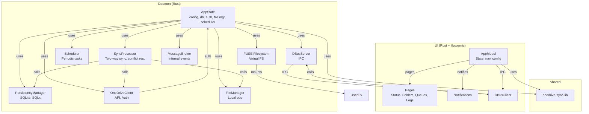

# OpenOneDrive


An experimental OneDrive sync client for Linux, featuring:

- FUSE-based virtual filesystem
- Two-way sync with conflict resolution
- UI (libcosmic, Rust)
- notifications and panel applet
- Designed for POP!_OS

---

## 🛸 WHAT IS IT exackly and how it differs fromfuser or ondrive client

The project does not aim to compete with [abraunegg/onedrive](https://github.com/abraunegg/onedrive) or [jsuf/onedriver](https://github.com/jstaf/onedriver).
In fact the first one will probably remain more complete and reach solution - the second will remain simple web FS. Both projects are great and more mature then this.

So how it differs form them ?
I want to build something that will be super easy to use and will just work for personal onedrive accounts.
I have no ambition to support sharepoint or Onedrive business.

### Instead I want to have

- ZERO configuration requirement.
- Simple UI ( not needed most of the time I hope)
- Best possible UX

### Different approach

I took another decissions to build this client. I want to keep a "sync" functionality to allow users work offline and sync data when they will got back online.
I also want to have download on demand functionality  that could make using the client easy.

Abraunegg ondrive is building a  direct reflection of Onedrive files on your hard drive, I'm keeping everything in DB. Further - I'm using Fuse to detect changes - not Inotify.
It has also selective sync functionality, which I think is to complicated from UX perspective.

Because I'm using flat DB and Fuse I think that  I can get a bit more flexibility. Another difference is that abraunegg onedrive is primarly a cli tool - dedicated external UI is operating on configuration files and triggers command line to integrate. It works, but it has also some limitatiations because of that.
Anyway that project is more solid solution with a different goal then this one.

In ondriver on the other hand the issue I did not liked was that the files are relfected as is from Cloud.
that causes a UX problems:

- when you open folder with your pictures Filemanager like nautilus or other will most probably attempt to build a thumbnails cache causing partial download of large ammount of files. It's true that this behaveiour occurs only once, but I wanted to avoid this.
- when you go offline your filesystem becames Read only. That might be hard to understand for end users.

So in essence we have different goals.

## 🚀 Features

- **FUSE Filesystem:** Mount your OneDrive as a local drive under ~/OneDrive
- **Two-way Sync:** Handles both remote and local changes

- **Modern UI:** Built with libcosmic for a native look
- **Notifications:** System and in-app notifications
- **Autostart Daemon:** User-level systemd service for background sync

---

## 🪲 BUGS and limitation

- **Conflicts resolution not implemented/tested:**  Conflict resolution is not tested and not fully implemented
- **Initial sync:** Similar to other projects it takes time. There is also no UI feedback
**!FIXED!Large Files:**  Large files are not supported yet.
- **Basic UI:** UI Is basic - it it more or less just a prototype
- **!FIXED!Bug Going back online:** At this moment going back online requires deamon restart
- **no preventive controls:** E.g. Onedrive is not case sensitive - attempt to create files: Test.txt and test.txt may lead to errors.
- **no hauskeeping** - it woudl be nice to have a possibility to remove old (not used for a long time) files from local drive. It's not implemented yet
- **Code quality*** - it shuld be better. No tests at this point for example.

---

### DISCLAIMER: THIS IS EXPERIMETAL PROJECT AND PRETTY YOUNG! IT MAY OR MAY NOT WORK! USE IT AT YOUR OWN RISK! IF YOU ARE LOOKING FOR SOMETHING MORE RELIABLE - JUST USE PROJECTS MENTIONED EARLIER IN THIS FILE

## 🏗️ Architecture



## 🛠️ Installation

### 1

1. **Install binaries and desktop files:**

   ```sh
   cd 
   resources/programfiles
   ./install.sh 
   ```

2. **Enable autostart daemon:**

   ```sh
   systemctl --user enable --now open-onedrive-daemon.service
   ```

---

## 🖥️ Desktop Integration

- **UI:** Launch "OpenOneDrive UI" from your app menu.
- **Daemon:** Hidden from menu, runs in background for sync and notifications.
- **MIME Handler:** Handles `application/onedrivedownload` files for direct download.
- **Applet** you can configure your panel or dock to include applet

---

## 📝 License

MIT

---

## 🙋 FAQ

- **Q: Where are files stored?**
  - A: Downloaded files are stored in a flat directory under `~/.local/share/onedrive-sync/downloads`.
- **What is the answer  to the Ultimate Question of Life, The Universe, and Everything?**
  - 42
`  

---

## 🤝 Contributing

PRs and issues welcome!
Get in contact: [https://github.com/digit1024](https://github.com/digit1024)
