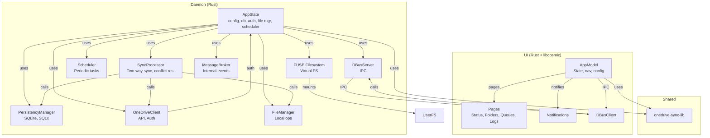

# OpenOneDrive

An experimental OneDrive sync client for Linux, featuring:
- FUSE-based virtual filesystem
- Two-way sync with conflict resolution
- Modern UI (libcosmic, Rust)
- notifications and panel applet (tbd)

- Designed for POP!_OS

---

## 🚀 Features
- **FUSE Filesystem:** Mount your OneDrive as a local drive
- **Two-way Sync:** Handles both remote and local changes
- **Conflict Resolution:** Smart strategies for file conflicts
- **Modern UI:** Built with libcosmic for a native look
- **Notifications:** System and in-app notifications
- **Autostart Daemon:** User-level systemd service for background sync
- **Flatpak & AppImage:** Easy distribution and installation

---

## 🏗️ Architecture



## 🛠️ Installation

### 1. 
1. **Build:**
   ```sh
   cargo build 
   ```
2. **Install binaries and desktop files:**
   ```sh
   ./resources/programfiles/install.sh 
   ```
3. **Enable autostart daemon:**
   ```sh
   systemctl --user enable --now open-onedrive-daemon.service
   ```


## ⚡ Autostart Daemon 
1. **Copy the service file:**
   ```sh
   cp resources/programfiles/open-onedrive-daemon.service ~/.config/systemd/user/
   ```
2. **Enable and start:**
   ```sh
   systemctl --user enable --now open-onedrive-daemon.service
   ```

---

## 🖥️ Desktop Integration
- **UI:** Launch "OpenOneDrive UI" from your app menu.
- **Daemon:** Hidden from menu, runs in background for sync and notifications.
- **MIME Handler:** Handles `application/onedrivedownload` files for direct download.

---


## 📝 License
MIT

---

## 🙋 FAQ

- **Q: Where are files stored?**
  - A: Downloaded files are stored in a flat directory under `~/.local/share/onedrive-sync/downloads`.
- **What is the answer  to the Ultimate Question of Life, The Universe, and Everything?**
  - 42 
`  
---

## 🤝 Contributing
PRs and issues welcome! 


