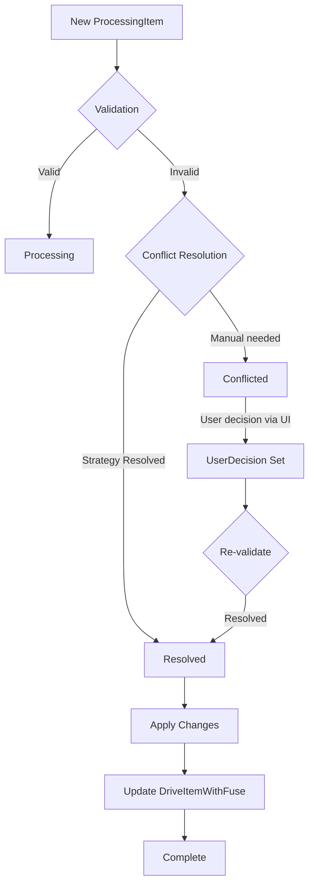

# Conflict Resolution Strategies

This document describes the conflict resolution strategies implemented in the OneDrive sync system, covering both local and remote changes for downloaded and not-downloaded files.

## Table of Contents

1. [Overview](#overview)
2. [Conflict Types](#conflict-types)
3. [Resolution Strategies](#resolution-strategies)
4. [Examples](#examples)
5. [Implementation Details](#implementation-details)

## Overview

The sync system detects conflicts when the same file has been modified both locally and remotely. The conflict resolution system handles these scenarios based on:

- **File download status** (downloaded vs placeholder)
- **Operation type** (Create, Update, Delete, Move, Rename)
- **Change source** (Local vs Remote)
- **User preferences** (Manual, AlwaysLocal, AlwaysRemote)

## Conflict Types

### 1. Content Conflicts
When the same file is modified in both locations:
- **Downloaded files**: Full content comparison available
- **Not-downloaded files**: Only metadata comparison possible

### 2. Name Collisions
When files with the same name exist in the same directory:
- Case sensitivity differences (OneDrive is case-insensitive)
- Simultaneous creation of files with same name

### 3. Tree Conflicts
When parent directories are moved or deleted:
- Parent folder deleted while child is modified
- Circular references from simultaneous moves

## Resolution Strategies

### 1. Always Remote Strategy
**Description**: Always prefer the remote (OneDrive) version over local changes.

**Use Cases**:
- When OneDrive is the source of truth
- For read-mostly scenarios
- When local changes are experimental

**Behavior**:
```
Local change + Remote change → Use Remote version
```

### 2. Always Local Strategy
**Description**: Always prefer local changes over remote updates.

**Use Cases**:
- When local device is primary workspace
- For offline-first workflows
- When local changes are authoritative

**Behavior**:
```
Local change + Remote change → Use Local version
```

### 3. Manual Strategy
**Description**: Require user intervention for every conflict.

**Use Cases**:
- When changes are critical
- For important documents
- When automated resolution might lose data

**Behavior**:
```
Local change + Remote change → Show conflict in UI → Wait for user decision
```

### 4. Additional Resolution Types

#### Use Newest
**Description**: Select the most recently modified version (requires timestamp comparison logic).

**Use Cases**:
- When latest changes are most valuable
- For collaborative documents
- Time-sensitive content

#### Keep Both
**Description**: Rename one version and keep both files.

**Use Cases**:
- When both versions might be valuable
- To avoid data loss
- For divergent changes

**Naming Convention**:
```
original.txt → original.txt
conflicted → original_conflict_2024-01-15.txt
```

#### Skip
**Description**: Skip the conflicted item and continue with other syncs.

**Use Cases**:
- Non-critical files
- Temporary conflicts
- When manual review is planned later

## Examples

### Example 1: File Updated Locally and Remotely
**Scenario**: User edits `report.docx` locally while colleague updates it on OneDrive.

**File State**:
- Downloaded: Yes
- Local modified: 2024-01-15 10:30
- Remote modified: 2024-01-15 10:45
- Conflict Strategy: AlwaysRemote

**Resolution Process**:
1. Conflict detected during sync
2. AlwaysRemote strategy applied
3. Decision: Use Remote version
4. Actions:
   - Local version could be backed up (if KeepBoth was chosen)
   - Remote version downloaded and replaces local
   - ProcessingItem marked as resolved
   - DriveItemWithFuse updated with new metadata

### Example 2: File Deleted Locally, Updated Remotely
**Scenario**: User deletes `old-notes.txt` locally, but it's updated on OneDrive.

**File State**:
- Downloaded: No (placeholder only)
- Local operation: Delete
- Remote operation: Update
- Conflict Strategy: AlwaysRemote

**Resolution Process**:
1. Conflict detected: Delete vs Update
2. AlwaysRemote strategy applied
3. Decision: Use Remote (restore file)
4. Actions:
   - Local delete cancelled
   - File metadata updated
   - File marked for download if in download folder

### Example 3: Same Filename Created in Both Locations
**Scenario**: `meeting-notes.txt` created locally and on OneDrive simultaneously.

**File State**:
- Local create time: 2024-01-15 09:00
- Remote create time: 2024-01-15 09:05
- Content different: Yes
- Conflict Strategy: Manual

**Resolution Process**:
1. Name collision detected
2. Manual strategy triggers UI notification
3. User presented with options in conflicts page:
   - Use Local (delete remote)
   - Use Remote (delete local)
   - Keep Both (rename one)
   - Skip (deal with later)
4. User selects "Keep Both"
5. Actions:
   - Local file kept as-is
   - Remote file downloaded with modified name
   - Both ProcessingItems resolved

### Example 4: User Decision Override
**Scenario**: Conflict detected with AlwaysRemote strategy, but user wants specific resolution.

**Resolution Process**:
1. Conflict detected, AlwaysRemote would apply
2. User navigates to Conflicts page in UI
3. User manually selects different resolution (e.g., "Keep Both")
4. UserDecision stored in ProcessingItem
5. Sync processor respects user decision over strategy

## Implementation Details

### ProcessingItem State Flow



### Data Structures

**ProcessingItem** tracks:
- `change_type`: Local or Remote
- `change_operation`: Create, Update, Delete, Move, Rename
- `conflict_resolution`: Applied resolution strategy result
- `user_decision`: Manual resolution choice from UI
- `validation_errors`: Conflict details

**ConflictResolution** enum:
- `UseRemote`: Use remote version
- `UseLocal`: Use local version  
- `Skip`: Skip this item
- `Manual`: Wait for user decision
- `UseNewest`: Use newest version
- `KeepBoth`: Keep both with different names

### UI Integration

The Conflicts page (`conflicts_page.rs`) provides:
- List of all current conflicts
- File details (size, modified time, download status)
- Resolution buttons for each conflict
- Auto-refresh every 10 seconds
- Clear visual separation between local and remote versions

### Separation of Concerns

- **Sync Strategy**: Only validates and detects conflicts
- **Conflict Resolver**: Determines resolution based on strategy
- **Sync Processor**: Applies the resolution
- **UI**: Presents conflicts and captures user decisions
- **Repositories**: Handle data persistence, not business logic

### Best Practices

1. **Use AlwaysRemote** for shared folders where OneDrive is authoritative
2. **Use AlwaysLocal** for personal work folders
3. **Use Manual** for critical documents
4. **Monitor Conflicts page** regularly when using Manual strategy
5. **Configure download folders** appropriately for your workflow

### Error Handling

- **Network failures**: Retry with exponential backoff
- **Permissions errors**: Flag for manual review
- **Storage full**: Pause and notify user
- **Invalid resolution**: Fall back to Manual strategy