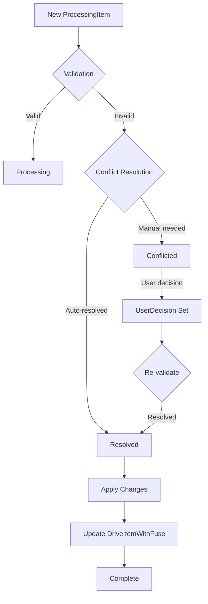

# Conflict Resolution Strategies

This document describes all conflict resolution strategies implemented in the OneDrive sync system, covering both local and remote changes for downloaded and not-downloaded files.

## Table of Contents

1. [Overview](#overview)
2. [Conflict Types](#conflict-types)
3. [Resolution Strategies](#resolution-strategies)
4. [Examples](#examples)
5. [Implementation Details](#implementation-details)

## Overview

The sync system detects conflicts when the same file has been modified both locally and remotely. The conflict resolution system handles these scenarios intelligently based on:

- **File download status** (downloaded vs placeholder)
- **Operation type** (Create, Update, Delete, Move, Rename)
- **Change source** (Local vs Remote)
- **User preferences** (Manual, AlwaysLocal, AlwaysRemote, Smart)

## Conflict Types

### 1. Content Conflicts
When the same file is modified in both locations:
- **Downloaded files**: Full content comparison available
- **Not-downloaded files**: Only metadata comparison possible

### 2. Name Collisions
When files with the same name exist in the same directory:
- Case sensitivity differences (OneDrive is case-insensitive)
- Simultaneous creation of files with same name

### 3. Tree Conflicts
When parent directories are moved or deleted:
- Parent folder deleted while child is modified
- Circular references from simultaneous moves

## Resolution Strategies

### 1. Always Remote Strategy
**Description**: Always prefer the remote (OneDrive) version over local changes.

**Use Cases**:
- When OneDrive is the source of truth
- For read-mostly scenarios
- When local changes are experimental

**Behavior**:
```
Local change + Remote change → Use Remote version
```

### 2. Always Local Strategy
**Description**: Always prefer local changes over remote updates.

**Use Cases**:
- When local device is primary workspace
- For offline-first workflows
- When local changes are authoritative

**Behavior**:
```
Local change + Remote change → Use Local version
```

### 3. Manual Strategy
**Description**: Require user intervention for every conflict.

**Use Cases**:
- When changes are critical
- For important documents
- When automated resolution might lose data

**Behavior**:
```
Local change + Remote change → Show conflict in UI → Wait for user decision
```

### 4. Smart Strategy (Adaptive)
**Description**: Intelligently resolve conflicts based on operation type and file state.

**Decision Matrix**:

| Operation | Downloaded File | Not-Downloaded File |
|-----------|----------------|---------------------|
| Create    | Use Newest     | Use Newest          |
| Update    | Use Newest     | Use Remote          |
| Delete    | Use Delete     | Use Delete          |
| Move      | Manual         | Manual              |
| Rename    | Keep Both      | Keep Both           |

### 5. Timestamp-Based Strategies

#### Use Newest
**Description**: Select the most recently modified version.

**Use Cases**:
- When latest changes are most valuable
- For collaborative documents
- Time-sensitive content

#### Use Oldest
**Description**: Preserve the original version.

**Use Cases**:
- When preserving history is important
- For archive scenarios
- When newer changes might be corrupted

### 6. Size-Based Strategies

#### Use Largest
**Description**: Select the version with more content.

**Use Cases**:
- When content is additive
- For log files
- When data loss is critical

#### Use Smallest
**Description**: Select the more compact version.

**Use Cases**:
- When compression occurred
- For cleaned-up versions
- When smaller means optimized

### 7. Keep Both Strategy
**Description**: Rename one version and keep both files.

**Naming Convention**:
```
original.txt → original.txt
conflicted → original_conflict_2024-01-15.txt
```

### 8. Skip Strategy
**Description**: Skip the conflicted item and continue with other syncs.

**Use Cases**:
- Non-critical files
- Temporary conflicts
- When manual review is planned later

## Examples

### Example 1: File Updated Locally and Remotely
**Scenario**: User edits `report.docx` locally while colleague updates it on OneDrive.

**File State**:
- Downloaded: Yes
- Local modified: 2024-01-15 10:30
- Remote modified: 2024-01-15 10:45
- Conflict Strategy: Smart

**Resolution Process**:
1. Conflict detected during sync
2. Smart strategy checks: File is downloaded + Update operation
3. Decision: Use Newest (Remote version is newer)
4. Actions:
   - Local version backed up to `report_local_backup_2024-01-15.docx`
   - Remote version downloaded and replaces local
   - ProcessingItem marked as resolved
   - DriveItemWithFuse updated with new metadata

### Example 2: File Deleted Locally, Updated Remotely
**Scenario**: User deletes `old-notes.txt` locally, but it's updated on OneDrive.

**File State**:
- Downloaded: No (placeholder only)
- Local operation: Delete
- Remote operation: Update
- Conflict Strategy: AlwaysRemote

**Resolution Process**:
1. Conflict detected: Delete vs Update
2. AlwaysRemote strategy applied
3. Decision: Use Remote (restore file)
4. Actions:
   - Local delete cancelled
   - File metadata updated
   - File marked for download if in download folder

### Example 3: Same Filename Created in Both Locations
**Scenario**: `meeting-notes.txt` created locally and on OneDrive simultaneously.

**File State**:
- Local create time: 2024-01-15 09:00
- Remote create time: 2024-01-15 09:05
- Content different: Yes
- Conflict Strategy: Manual

**Resolution Process**:
1. Name collision detected
2. Manual strategy triggers UI notification
3. User presented with options:
   - Use Local (delete remote)
   - Use Remote (delete local)
   - Keep Both (rename one)
   - Compare content (if downloaded)
4. User selects "Keep Both"
5. Actions:
   - Local file kept as-is
   - Remote file downloaded as `meeting-notes_onedrive.txt`
   - Both ProcessingItems resolved

### Example 4: Folder Moved While File Inside Modified
**Scenario**: Folder `/Documents/Projects` moved to `/Archive/Projects` remotely while `project.md` inside is edited locally.

**File State**:
- Parent folder moved remotely
- Child file modified locally
- Conflict Strategy: Smart

**Resolution Process**:
1. Tree conflict detected
2. Smart strategy for Move operation → Manual resolution required
3. User notified of structural conflict
4. Options presented:
   - Apply remote move (relocate local changes)
   - Keep local structure (reject remote move)
   - Merge (apply both changes)
5. Actions depend on user choice

### Example 5: Not-Downloaded File Conflict
**Scenario**: Placeholder file `large-video.mp4` metadata updated locally (renamed) while content updated remotely.

**File State**:
- Downloaded: No (placeholder only, 0 bytes locally)
- Local operation: Rename to `large-video-final.mp4`
- Remote operation: Content update (new version)
- Conflict Strategy: Smart

**Resolution Process**:
1. Conflict detected on placeholder file
2. Smart strategy: Not-downloaded + Update → Use Remote
3. Decision: Accept remote changes, defer rename
4. Actions:
   - Remote metadata accepted
   - Local rename queued for after download
   - Placeholder updated with new size/modified date
   - If in download folder, queued for download

## Implementation Details

### ProcessingItem State Flow



### Data Structures

**ProcessingItem** tracks:
- `change_type`: Local or Remote
- `change_operation`: Create, Update, Delete, Move, Rename
- `conflict_resolution`: Applied resolution strategy
- `user_decision`: Manual resolution choice
- `validation_errors`: Conflict details

**DriveItemWithFuse** maintains:
- `file_source`: Remote, Local, or Merged
- `sync_status`: Current sync state
- `virtual_ino`: FUSE filesystem inode
- Download status via `size` (0 = not downloaded)

### Conflict Detection Logic

1. **Same ID Check**: Compare drive_item.id for both changes
2. **Operation Compatibility**: Check if operations can coexist
3. **Timestamp Comparison**: For content conflicts
4. **Structural Validation**: Ensure parent paths are valid

### Resolution Application

1. **Conflict Detected**: Create validation errors
2. **Strategy Selection**: Based on user config or smart logic
3. **Resolution Decision**: Apply strategy to get resolution
4. **Action Execution**:
   - Update metadata
   - Queue downloads/uploads
   - Rename files if needed
   - Update database state
5. **Notification**: Inform user of resolution

### Best Practices

1. **Always backup before resolution** for critical files
2. **Use Smart strategy** for balanced automation
3. **Monitor Manual queue** regularly
4. **Configure download folders** to optimize placeholder handling
5. **Test resolution strategies** in non-critical folders first

### Error Handling

- **Network failures**: Retry with exponential backoff
- **Permissions errors**: Flag for manual review
- **Corrupt metadata**: Rebuild from remote
- **Storage full**: Pause and notify user