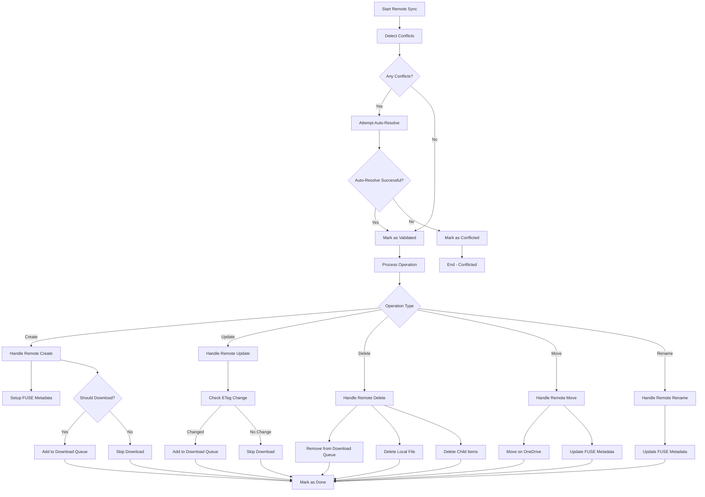
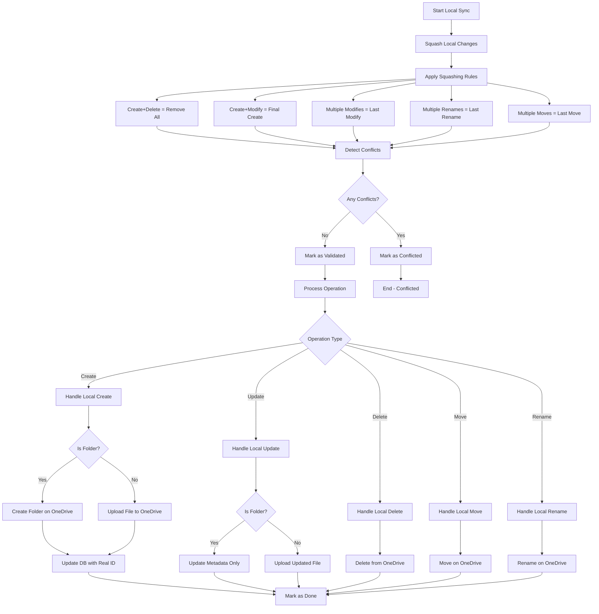

# Sync Process Decision Flow Diagrams

## Remote Changes Sync Flow

## Local Changes Sync Flow

## Key Sync Process Details

### Priority-Based Processing
- **Remote changes** are processed first (sync_processor.rs:41-54)
- **Local changes** are processed after remote changes are handled

### Conflict Detection
- Uses **ctag/etag comparison** for content conflicts
- **Parent state checks** (deleted parent detection)
- **Name collision detection** in target directories
- **Operation type matching** (Create vs Create, Update vs Delete, etc.)

### Auto-Resolution Capabilities
- Attempts to **restore deleted parents** from OneDrive
- Handles **metadata-only changes** automatically
- Resolves **parent chain recreation** for moved items

### Local Change Squashing Rules
1. **Create + Delete sequence** = Remove all processing items
2. **Create + Modifications** = Final Create operation
3. **Multiple Modifies** = Keep only last Modify
4. **Multiple Renames** = Keep only last Rename
5. **Multiple Moves** = Keep only last Move

### File Download Logic
- **Folders**: Downloaded on demand when accessed
- **Files**: Downloaded based on configured download folders
- **ETag changes**: Trigger re-download of modified files
- **Parent-based filtering**: Only downloads files in specified folders

### Database Operations
- **Temporary ID management**: Local files get temporary IDs until synced
- **ID propagation**: Updates all references when temporary IDs become real OneDrive IDs
- **Parent-child relationships**: Maintains proper parent inode references
- **Sync status tracking**: Tracks sync state for each item

### Error Handling
- **Conflicted items**: Marked for manual resolution
- **Processing errors**: Retry mechanism with error status
- **Parent recreation**: Automatic folder structure restoration
- **Download queue management**: Proper cleanup of deleted items